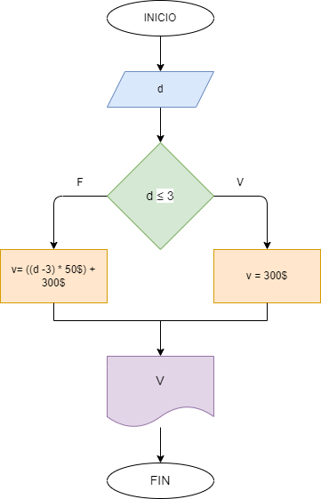

# Ejercicio 1: valor de una llamada.

## Diagrama de flujo

### Analisis:

    Se pide la cantidad de minutos, se verifica si es menor o igual que 3, si es verdadero el valor de la llamada es de 300$, si es falso a la cantidad de minutos se le resta 3; y al resultado de esa resta se le multiplica por 50$ y se suma 300$.