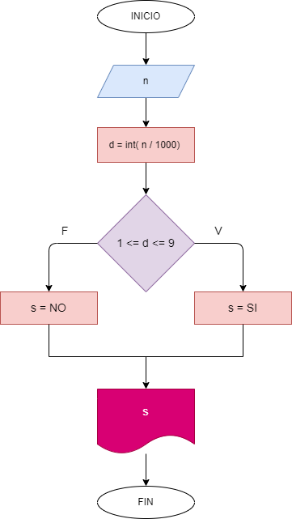

# Ejercicio 3: determinar si es un numero positivo de 4 digitos.

## Diagrama de flujo

### Analisis:

    Se pide un numero; a ese numero se le hace la division por 1000 y se convierte en un entero, si ese resultado de la division es mayor o igual a 1 Y menor o igual a 9, entonces SI es un numero positivo de cuatro digitos, de lo contrario, NO es un numero positivo de cuatro digitos.