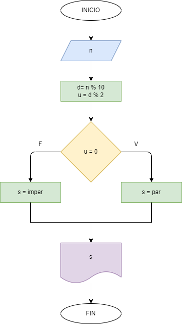

# Ejercicio 4: determinar si el ultimo digito de un numero es par.

## Diagrama de flujo

### Analisis:

    Se pide un numero; a ese numero se le hace el modulo por 10 (% 10); a ese resultado se le saca el modulo por 2; se compara si es igual a 0, en caso de ser verdadero el ultimo digito seria par, de lo contrario no es par.